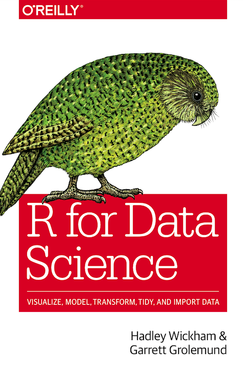
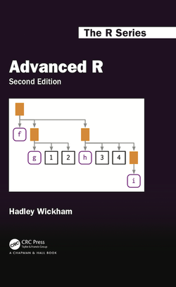
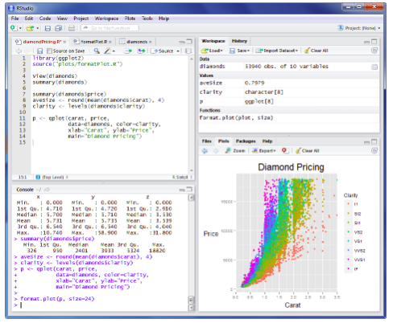

---

---

<h1 id="metropolitan-data-1---r-tutorials">Metropolitan Data 1 - R Tutorials</h1>

The <strong>Metropolitan Data 1 - R Tutorials</strong> materials and resources of the 2018/2019 Metropolitan Data 1 Course at <a href="https://www.ams-institute.org/">Amsterdam Institute for Advanced Metropolitan Solutions</a> are listed here.

<h2 id="table-of-contents----omit-in-toc---">Table of Contents <!-- omit in toc --></h2>
<ul>
<li><a href="#colophon">Colophon</a></li>
<li><a href="#r-tutorial-course-book">R Tutorial course book</a></li>
<li><a href="#tools">Tools</a>
<ul>
<li><a href="#recommended">Recommended</a></li>
<li><a href="#required">Required</a></li>
</ul>
</li>
<li><a href="#r-tutorials">R tutorials</a>
<ul>
<li><a href="#tutorial-1-an-introduction-to-r---part-1">Tutorial #1: An introduction to R - part 1</a></li>
<li><a href="#tutorial-2-an-introduction-to-r---part-2">Tutorial #2: An introduction to R - part 2</a></li>
<li><a href="#tutorial-3-data-manipulation">Tutorial #3: Data manipulation</a></li>
<li><a href="#tutorial-4-data-visualization">Tutorial #4: Data Visualization</a></li>
<li><a href="#tutorial-5-data-transformation">Tutorial #5: Data transformation</a></li>
</ul>
</li>
</ul>
<h2 id="colophon">Colophon</h2>

<strong>Course coordinator:</strong> <a href="https://julian-urbano.info/">Dr. Julián Urbano</a> 
<strong>Teaching assistants:</strong> <a href="https://homepages.dcc.ufmg.br/~harlley/">Harlley Lima</a> and <a href="https://www.tudelft.nl/ewi/over-de-faculteit/afdelingen/intelligent-systems/multimedia-computing/people/manel-slokom/">Manel Slokom</a>

<h2 id="r-tutorial-course-book">R tutorial course book</h2>

Most of the R tutorials for the courser were based on <a href="https://r4ds.had.co.nz/"><strong>R for Data Science</strong></a> by Hadley Wickham &amp; Garrett Grolemund. In general, this book covers Data manipulation, visualization, and transformation - topics covered in these tutorials. The first two R tutorials presented here were based on the Foundations chapter of <a href="https://adv-r.hadley.nz/"><strong>Advanced R</strong></a> by Hadley Wickham.

 

<h2 id="tools">Tools</h2>
<h3 id="recommended">Recommended</h3>

<a href="https://rstudio.com/">RStudio</a> is an IDE which provided tools designed to enhance the productivity with R, we strongly recommended development environment for this course. RStudio includes an editor (syntax highlighting, code completion, and smart indentation) from which the code can be easily executed, as well as a console and tools for debugging, plotting, and history. Best of all, RStudio is integrated with R help and documentation, making easy to solve most of the questions that you may have. 
<strong>Open-source</strong> and commercial RStudio editions can be downloaded <a href="https://rstudio.com/products/rstudio/">here</a>, it is also available for Windows, Mac, and Linux.

<h3 id="required">Required</h3>

Of course, you need to install R. If you choose to install RStudio, then you don’t need to worry to install R since it is already installed with RStudio. Otherwise, you need to install R, coding with an editor more convenient for you, and then run your code from the command line.  Please, use RStudio to have a nice R experience :)

<h2 id="r-tutorials">R tutorials</h2>

For all tutorials are available the presentation pdf, pdf latex files (if want to improve the presentation go for it, and let me know :) ), and R script.

<h3 id="tutorial-1-an-introduction-to-r---part-1">Tutorial #1: An introduction to R - part 1</h3>

This tutorial convers:

<ul>
<li><strong>Coding basics</strong>: console, expression, operators, variables, relational operators, logical operators,  basic data types</li>
<li><strong>Built-in Functions</strong></li>
<li><strong>Data types</strong>: vectors, factors, matrices and arrays, list and data frames</li>
</ul>

[<a href="01.%20Tutorial_IntroRPart1/Tutorial_IntroRPart1.pdf">pdf</a>], [<a href="01.%20Tutorial_IntroRPart1/Tutorial_IntroRPart1.zip">latex files</a>], [<a href="01.%20Tutorial_IntroRPart1/script">script</a>]

<h3 id="tutorial-2-an-introduction-to-r---part-2">Tutorial #2: An introduction to R - part 2</h3>

This tutorial convers:

<ul>
<li><strong>R Script and RStudio</strong>: code completion, exectuing code, keyboard shortcuts</li>
<li><strong>Control structures</strong>:
<ul>
<li><strong>Conditional exectuion</strong>: <em>if</em> and <em>if-else</em> statements</li>
<li><strong>Repetitive exectuion</strong>: <em>for</em> loops, <em>repeat</em> and <em>while</em></li>
</ul>
</li>
<li><strong>User-defined functions</strong>:  summary measures functions, defining a function, argument matching, the … argument</li>
<li><strong>Loop functions</strong>: <em>lapply()</em>, <em>sapply()</em>, <em>apply()</em></li>
</ul>

[<a href="02.%20Tutorial_IntroRPart2/Tutorial_IntroRPart2.pdf">pdf</a>], [<a href="02.%20Tutorial_IntroRPart2/Tutorial_IntroRPart2.zip">latex files</a>], [<a href="02.%20Tutorial_IntroRPart2/script">script</a>]

<h3 id="tutorial-3-data-manipulation">Tutorial #3: Data manipulation</h3>

This tutorial convers:

<ul>
<li><strong>Packages</strong></li>
<li><strong>Tibbles</strong></li>
<li><strong>Data import</strong></li>
<li><strong>Tidy data</strong>: spreading, gathering, separating, uniting and missing values</li>
<li><strong>Relational data</strong>:  keys and mutating joins</li>
</ul>

[<a href="03.%20Tutorial_Data/Tutorial_Data_R.pdf">pdf</a>], [<a href="03.%20Tutorial_Data/Tutorial_Data_R.zip">latex files</a>], [<a href="03.%20Tutorial_Data/script">script</a>]

<h3 id="tutorial-4-data-visualization">Tutorial #4: Data Visualization</h3>

This tutorial convers:

<ul>
<li><strong>ggplot2</strong>: aesthetic mappings, facets, geometric objects, position adjustments</li>
<li><strong>Exploratory data analysis</strong>: variation and covariation</li>
</ul>

[<a href="04.%20Tutorial_Data_Visualization/Tutorial_Data_Visualization.pdf">pdf</a>], [<a href="04.%20Tutorial_Data_Visualization/Tutorial_Data_Visualization.zip">latex files</a>], [<a href="04.%20Tutorial_Data_Visualization/script">script</a>]

<h3 id="tutorial-5-data-transformation">Tutorial #5: Data transformation</h3>

This tutorial convers:

<ul>
<li><strong>Primary functions</strong>: <em>select(), select(), group_by(), summarise(), arrange(), mutate(), mutate()</em></li>
<li><strong>RStudio project</strong>: RStudio project creation and working directory</li>
</ul>

[pdf], [latex files], [script]

